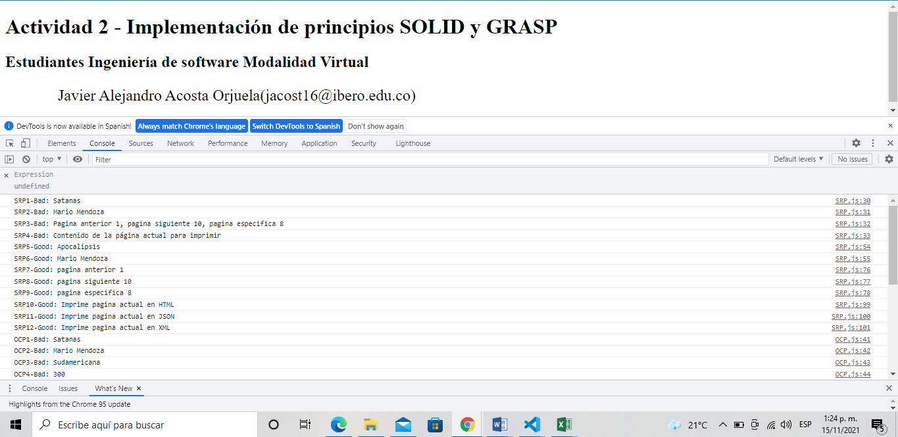
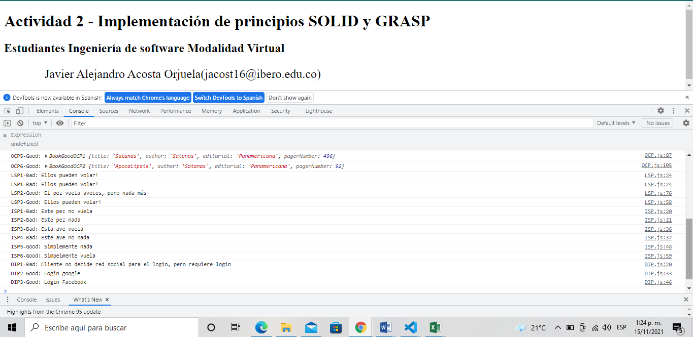
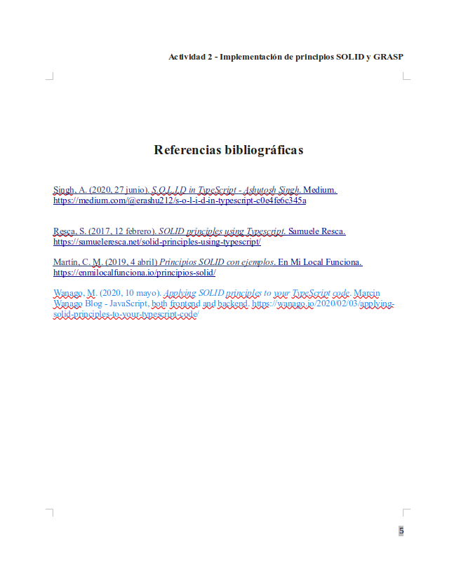

___

# Actividad 2 - Implementación de principios SOLID y GRASP

Este proyecto fue generado con [Typescript](https://www.typescriptlang.org/) versión 3.8.3.

## Servidor de desarrollo

Ejecute `tsc *ts --watch` para un servidor de desarrollo (por si se requieren hacer cambios en los archivos `.ts` y se quieran ver reflejados). Vaya a `../SOLID/index.html`. La aplicación se recargará automáticamente si cambia alguno de los archivos de origen.

## Implementación de principios SOLID

Estos principios, cuando se combinan, facilitan que un programador desarrolle software que sea fácil de mantener, entender y sea menos costoso en el momento de crear un nuevo modulo en su aplicativo. También se le facilita la vida a los desarrolladores, refactorizar fácilmente el código y también son parte del desarrollo ágil de software.

A continuación se ilustraran los principios, por medio de codificación y pruebas de su correcto funcionamiento. Las cuales serán evidenciadas en la consola del buscador donde se encuentro visualizándose el archivo index.html:

***Fuente:** original*

#### Principio de responsabilidad única (SRP)

Forma **INCORRECTA**
~~~
/*
* Esta clase no cumple con el principio de SRP, ya que en una sola clase está obteniendo atributos
* de la clase book, está paginando el libro y está imprimiendo la pagina actual del libro.
* 
*/
class BookBad {
    /** Propiedades o atributos (Caracteristicas del objeto) */
    title: string;
    author: string;
    prevPage: number;
    nextPage: number;
    specificPage: number;

    /** Métodos (Funciones o acciones del objeto) */
    getTitle() {
        return this.title = "Satanas";
    }

    getAuthor() {
        return this.author = "Mario Mendoza";
    }

    turnPage(prevPager = 1, nextPage = 10, specificPage = 8) {
        // Evento que para paginar libro
        return `Pagina anterior ${prevPager}, pagina siguiente ${nextPage}, pagina especifica ${specificPage}`;
    }

    printCurrentPage() {
        return "Contenido de la página actual para imprimir";
    }
}

/** Instancia del objeto en una variable e impresión en consola */
var bookBad = new BookBad();
console.log('SRP1-Bad:', bookBad.getTitle());
console.log('SRP2-Bad:', bookBad.getAuthor());
console.log('SRP3-Bad:', bookBad.turnPage());
console.log('SRP4-Bad:', bookBad.printCurrentPage());

~~~

Forma **CORRECTA**
~~~
/*
* Estas clases cumplen con el principio de SRP, ya que se dividen en diferentes clases
* obteniendo atributos propios del libro en una clase, eventos en otra clase y operaciones en 
* otra clase.
*/
class BookGood {
    /** Propiedades o atributos (Caracteristicas del objeto) */
    title: string;
    author: string;

    /** Métodos (Funciones o acciones del objeto) */
    getTitle() {
        return this.title = "Apocalipsis";
    }

    getAuthor() {
        return this.author = "Mario Mendoza";
    }
}

/** Instancia del objeto en una variable e impresión en consola */
var bookGood = new BookGood();
console.log('SRP5-Good:', bookGood.getTitle());
console.log('SRP6-Good:', bookGood.getAuthor());

class Pager {
    /** Propiedades o atributos (Caracteristicas del objeto) */
    prevPager: number;
    nextPager: number;
    pagerNumber: number;

    /** Métodos (Funciones o acciones del objeto) */
    gotoPrevPage(prevPager: number) {
        // Evento a la página anterior
        return prevPager;
    }

    gotoNextPage(nextPager: number) {
        // Evento a la página siguiente
        return nextPager;
    }

    gotoPageByPageNumber(pagerNumber: number) {
        // Evento a una página especifca
        return pagerNumber;
    }
}

/** Instancia del objeto en una variable e impresión en consola */
var pagerGood = new Pager();
console.log('SRP7-Good: pagina anterior', pagerGood.gotoPrevPage(1));
console.log('SRP8-Good: pagina siguiente', pagerGood.gotoNextPage(10));
console.log('SRP9-Good: pagina especifica', pagerGood.gotoPageByPageNumber(8));

class Printer {

    /** Métodos (Funciones o acciones del objeto) */
    printPageInHTML(pageContent: any) {
        // Operacion a ejecutar con el parametro recibido
        return pageContent;
    }

    printPageInJSON(pageContent: any) {
        // Operacion a ejecutar con el parametro recibido
        return pageContent;
    }

    printPageInXML(pageContent: any) {
        // Operacion a ejecutar con el parametro recibido
        return pageContent;
    }
}

/** Instancia del objeto en una variable e impresión en consola */
var printerGood = new Printer();
console.log('SRP10-Good:', printerGood.printPageInHTML('Imprime pagina actual en HTML'));
console.log('SRP11-Good:', printerGood.printPageInJSON('Imprime pagina actual en JSON'));
console.log('SRP12-Good:', printerGood.printPageInXML('Imprime pagina actual en XML'));

~~~

*Pruebas de su funcionamiento*

***Fuente:** original*

___

#### Principio abierto cerrado (OCP)

Forma **INCORRECTA**
~~~
/*
* Esta clase no cumple con el principio de OCP, ya que Las entidades deben estar abiertas
* para su extensión pero cerradas para modificaciones y en este ejemplo 
* Simplemente podemos modificar la lógica del código para proporcionar más información, y si
* se manejan varios libros tendriamos seríos problemas.
* 
*/
class BookBadOCP {
    /** Propiedades o atributos (Caracteristicas del objeto) */
    title: string;
    author: string;
    editorial: string;
    pagerNumber: number;

    /** Métodos (Funciones o acciones del objeto) */
    getTitle(): string {
        return this.title = 'Satanas';
    }

    getAuthor(): string {
        return this.author = 'Mario Mendoza';
    }

    getEditorial(): string {
        return this.editorial= 'Panamericana ';
    }

    getPagerNumber(): number {
        return this.pagerNumber = 300;
    }
}

/** Instancia del objeto en una variable e impresión en consola */
var bookBadOCP = new BookBadOCP();
console.log('OCP1-Bad:', bookBadOCP.getTitle());
console.log('OCP2-Bad:', bookBadOCP.getAuthor());
console.log('OCP3-Bad:', bookBadOCP.getEditorial());
console.log('OCP4-Bad:', bookBadOCP.getPagerNumber());

~~~

Forma **CORRECTA**
~~~
/*
* Estas clases cumplen con el principio de OCP, ya que Las entidades deben estar abiertas
* para su extensión pero cerradas para modificaciones, como lo vemos en los ejemplos hay una
* clase abierta para su extensión de datos, pero es cerrada con sus propiedades.
*/
class BookGoodOCP {
    /** Propiedades o atributos (Caracteristicas del objeto) */
    title: string;
    author: string;
    editorial: string;
    pagerNumber: number;

    constructor(title: string, pagerNumber: number) {
        this.title = title;
        this.author = 'Mario Mendoza';
        this.editorial = 'Panamericana ';
        this.pagerNumber = pagerNumber;
    }

    /** Métodos (Funciones o acciones del objeto) */
    getTitle(): string {
        return this.title;
    }

    getEditorial(): string {
        return this.editorial;
    }

    getPagerNumber(): number {
        return this.pagerNumber;
    }
}

/** Ejemplo 1 */
class BookGoodOCP1 extends BookGoodOCP {

    /** Métodos (Funciones o acciones del objeto) */
    getTitle(): string {
        return this.title;
    }

    getPagerNumber(): number {
        return this.pagerNumber;
    }
}

/** Instancia del objeto en una variable e impresión en consola */
var bookGoodOCP1 = new BookGoodOCP1('Satanas', 496);
console.log('OCP5-Good:', bookGoodOCP1);

/** Ejemplo 2 */
class BookGoodOCP2 extends BookGoodOCP {

    /** Métodos (Funciones o acciones del objeto) */
    getTitle(): string {
        return this.title;
    }

    getPagerNumber(): number {
        return this.pagerNumber;
    }
}

/** Instancia del objeto en una variable e impresión en consola */
var bookGoodOCP2 = new BookGoodOCP2('Apocalipsis', 92);
console.log('OCP6-Good:', bookGoodOCP2);

~~~

*Pruebas de su funcionamiento*

***Fuente:** original*

___

#### Principio de sustitución de Liskov (LSP)

Forma **INCORRECTA**
~~~
/**
 * En estas clase no cumplen el principio LSP porque, el principio nos dice que
 * que los tipos derivados deben ser completamente sustituibles por sus tipos base y en las clases
 * de ejemplo ninguna sustituyo a ninguna.
 */
class BirdBad {
    /** Métodos (Funciones o acciones del objeto) */
    fly() {
        console.log('LSP1-Bad: Ellos pueden volar!');
    }
}

class FlyingFish extends BirdBad {
    constructor() {
        super()
    }
}

class Eagle extends BirdBad {
    constructor() {
        super()
    }
}

/** Instancia del objeto en una variable e impresión en consola */
var flyingFish = new FlyingFish();
flyingFish.fly();

var eagle = new Eagle();
eagle.fly();

~~~

Forma **CORRECTA**
~~~
/**
 * En estas clases se evidencia que este principio es una variación del principio OCP,
 * dice que los tipos derivados deben ser completamente sustituibles por sus tipos base, o en
 * otras palabras del lado del cliente.
 */
class BirdGood {
    /** Métodos (Funciones o acciones del objeto) */
    flyGood() {
        console.log('LSP3-Good: Ellos pueden volar!');
    }
}

class EagleGood extends BirdGood {
    constructor() {
        super()
    }
}

class FlyingFishGood extends BirdGood {
    constructor() {
        super()
    }

    /** Métodos (Funciones o acciones del objeto) */
    flyGood() {
        console.log("LSP2-Good: El pez vuela aveces, pero nada más");
    }
}

/** Instancia del objeto en una variable e impresión en consola */
var flyingFishGood = new FlyingFishGood();
flyingFishGood.flyGood();

var eagleGood = new EagleGood();
eagleGood.flyGood();

~~~

*Pruebas de su funcionamiento*

***Fuente:** original*

___

#### Principio de segregación de interfaz (ISP)

Forma **INCORRECTA**
~~~
/**
 * Este ejemplo no cumple el principio ISP, ya que la clase FishISP necesita implementar
 * el método fly() que no usa su objeto. De manera similar, EageleISP necesita implementar swim(), 
 * que no debe hacer.
 */

interface IBird {
    /** Métodos a implementar en clases */
    fly();
    swim();
}

class FishISP implements IBird {
    /** Métodos (Funciones o acciones del objeto) */
    fly() {
        return 'Este pez no vuela';
    }
    swim() {
        return 'Este pez nada';
    }
}

/** Instancia del objeto en una variable e impresión en consola */
var fishISP = new FishISP();
console.log('ISP1-Bad:', fishISP.fly());
console.log('ISP2-Bad:', fishISP.swim());

class EageleISP implements IBird {
    /** Métodos (Funciones o acciones del objeto) */
    fly() {
        return 'Esta ave vuela';
    }
    swim() {
        return 'Este ave no nada';
    }
}

/** Instancia del objeto en una variable e impresión en consola */
var eageleISP = new EageleISP();
console.log('ISP3-Bad:', eageleISP.fly());
console.log('ISP4-Bad:', eageleISP.swim());

~~~

Forma **CORRECTA**
~~~
/**
 * Este ejemplo cumple el principio ISP, ya que la clase FishISP2 necesita implementar
 * el método swim() y el objeto lo está utilizando. De manera similar, EageleISP2 necesita
 * implementar swim(), y el objeto lo está utilizando.
 */

interface IFishBird {
    swim();
}

interface IEagleBird {
    fly();
}

class FishISP2 implements IFishBird {
    swim() {
        return 'Simplemente nada';
    }
}

/** Instancia del objeto en una variable e impresión en consola */
var fishISP2 = new FishISP2();
console.log('ISP5-Good:', fishISP2.swim());

class EageleISP2 implements IEagleBird {
    fly() {
        return 'Simpelmente vuela';
    }
}

/** Instancia del objeto en una variable e impresión en consola */
var eageleISP2 = new EageleISP2();
console.log('ISP6-Good:', eageleISP2.fly());

~~~

*Pruebas de su funcionamiento*

***Fuente:** original*

___

#### Principio de inversión de dependencia (DIP)

Forma **INCORRECTA**
~~~
/**
 * Los módulos de alto nivel no deben depender de módulos de bajo nivel.
 * Más bien, ambos deberían depender de abstracciones.
 * 
 * Esta clase no cumple con el principio de DIP porque supongamos que un cliente ha cambiado de
 * opinión y ahora quiere implementar algún otro inicio de sesión social.
 * Este código no funcionará.
 */

class Login { 
    login(noSocialNetwork: any) { 
        // Logica para utilizar el inicio de sesión de google.
        return noSocialNetwork;
    }
}

/** Instancia del objeto en una variable e impresión en consola */
var login = new Login();
console.log('DIP1-Bad:', login.login('Cliente no decide red social para el login, pero requiere login'));

~~~

Forma **CORRECTA**
~~~
/**
 * Estas clases ya cumple con el principio de DIP porque ya puede ser escalable en el caso que
 * el cliente requiera una o varias sesiones con diferentes redes sociales.
 */

interface ISocialLogin {
    /** Métodos a implementar en clases */
    login(options: any);
 }

class GoogleLogin implements ISocialLogin {
    /** Métodos (Funciones o acciones del objeto) */
    login(googleLogin: any) { 
        // Logica para utilizar el inicio de sesión de google.
        return googleLogin;
    }
}

/** Instancia del objeto en una variable e impresión en consola */
var googleLogin = new GoogleLogin();
console.log('DIP2-Good:', googleLogin.login('Login google'));

class FBLogin implements ISocialLogin {
    /** Métodos (Funciones o acciones del objeto) */
    login(fbLogin: any) { 
        // Logica para utilizar el inicio de sesión de facebook.
        return fbLogin;
    }
}

/** Instancia del objeto en una variable e impresión en consola */
var fBLogin = new FBLogin();
console.log('DIP3-Good:', fBLogin.login('Login Facebook'));

~~~

*Pruebas de su funcionamiento*

***Fuente:** original*

___

___

